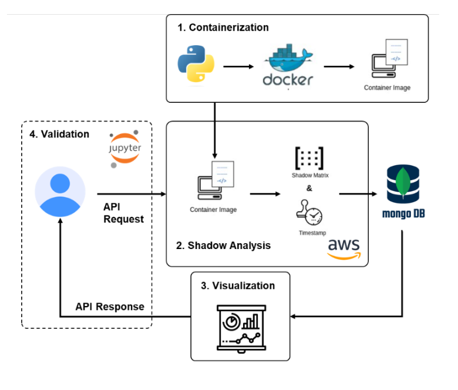
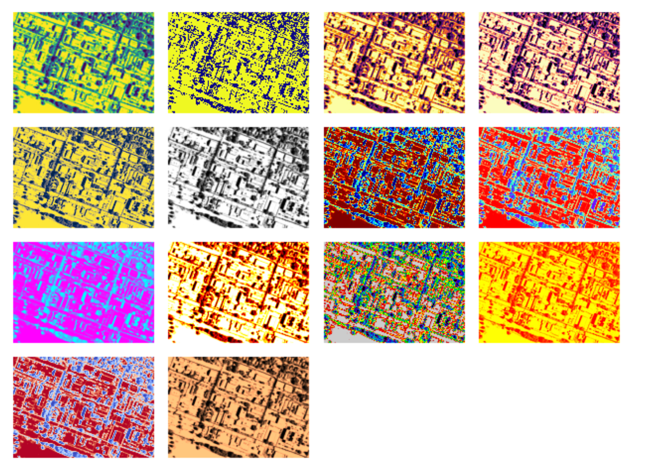

# AWS Demo

# API definition

## How to trigger

1. Trigger in terminal:
`curl https://iqf1uezcub.execute-api.us-east-1.amazonaws.com/stage/run_a1_shadow_analysis`
1. Trigger in Python:
```python
import requests
API_URL = 'https://iqf1uezcub.execute-api.us-east-1.amazonaws.com/stage/run_a1_shadow_analysis'
response = requests.get(API_URL)
```

## Request
`GET https://iqf1uezcub.execute-api.us-east-1.amazonaws.com/stage/run_a1_shadow_analysis`


## Response
Response to the API call is a json file.

Example Format: 
```json
{
  "Message": "Request was successful!",
  "Timestamp": "2023-10-16 09:45",
  "ShadowMatrix": [[889], [1228], "This is a 2D array of shape 889 * 1228"]
}
```

# Architecture



# Detailed design documentation

1. Containerization

Containerize the Python application into a Docker image exposing port `56789`.

The container could be found at Docoer Hub: https://hub.docker.com/r/zhenglinli9875/a1-shadow-analysis-python

2. Host on AWS

The program is running on a EC2 instant as the API backend server.

2. Shadow Analysis

Perform shadow analysis based on the timestamp of the API call in Central Timezone (CT), generate a shadow matrix.

3. Store the results in MongoDB

After generation shadow matrix, we store the **timestamps** and generated **2d array** to the MongoDB Atlas.

4. Visualization

When the user call the API, they will get a json response.

In the json response, users are able to extract the 2d array shadow matrix.

In the `demo.ipynb`, I visualize the shadow matrix effectively.




4. Validation

In the `demo.ipynb`, I validate the successful execution of the above steps. It involves user requests
for shadow analysis via the API and the visualization.