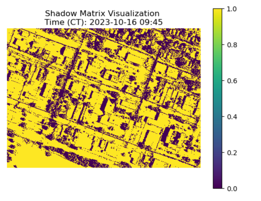

# AWS Demo: A1 Shadow Analysis

🥳 Video Demo: https://youtu.be/2XR3jWYdZZ4

## Overview

This project demonstrates a shadow analysis API hosted on AWS, utilizing a combination of technologies for analyzing shadows, storing results, and providing visualizations. The API allows users to trigger shadow analysis and obtain shadow matrices.

## API Usage

### How to Trigger

You can trigger the API either via the terminal or using Python.

#### Trigger in Terminal:

```bash
curl https://iqf1uezcub.execute-api.us-east-1.amazonaws.com/stage/run_a1_shadow_analysis
```

#### Trigger in Python:

```python
import requests
API_URL = 'https://iqf1uezcub.execute-api.us-east-1.amazonaws.com/stage/run_a1_shadow_analysis'
response = requests.get(API_URL)
```

## Request

Method: GET

URL: https://iqf1uezcub.execute-api.us-east-1.amazonaws.com/stage/run_a1_shadow_analysis


## Response
The response to the API call is a JSON file in the following format:
```json
{
  "Message": "Request was successful!",
  "Timestamp": "2023-10-16 09:45",
  "ShadowMatrix": [[889], [1228], "This is a 2D array of shape 889 * 1228"]
}
```

## Features
- High performance, each request are expected to get a response in 10s
- Logging support, logs can be found in `log.log` file
- Cloud support, all servers running on AWS and database running on MongoDB Atlas
- Code style, high quality code style

## Architecture


# Detailed design documentation

1. Containerization

The Python application is containerized into a Docker image exposed on port 56789. 

You can find the container on Docker Hub at zhenglinli9875/a1-shadow-analysis-python.

2. Host on AWS

The program runs on an EC2 instance as the API backend server, ensuring scalability and reliability.

2. Shadow Analysis

Shadow analysis is performed based on the timestamp of the API call in the Central Timezone (CT), generating a shadow matrix.


3. Storing Results in MongoDB

After generating the shadow matrix, the visualization results are stored in MongoDB Atlas. 

The data in the MongoDB includes timestamps and the serial of base64 encoded string of the visualization results.

4. Visualization

When the user call the API, they will get a json response.

In the json response, users are able to extract a serial of base64 encoded string of the visualization results.

In the `demo.ipynb`, I demonstrated how to do so.




